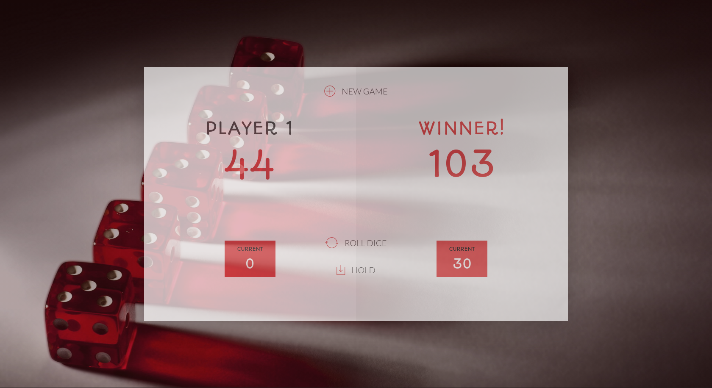

# Dom Pig(dice game)

> [Pig game](https://en.wikipedia.org/wiki/Pig_(dice_game))

## GAME RULES:

- The game has 2 players, playing in rounds
- In each turn, a player rolls a dice as many times as he whishes. Each result get added to his ROUND score
- BUT, if the player rolls a 1, all his ROUND score gets lost. After that, it's the next player's turn
- The player can choose to 'Hold', which means that his ROUND score gets added to his GLOBAL score. After that, it's the next player's turn
- The first player to reach 100 points on GLOBAL score wins the game

## Built With

- HTML, CSS & JavaScript

## Live Demo

[Live Demo Link](https://trekab.github.io/dom-pig-game/)

## Getting Started

To get a local copy up and running follow these simple example steps.
- `git clone git@github.com:trekab/dom-pig-game.git`

Then you browse to the folder and exucute the following commands
- `cd dom-pig-game`
- double click on the `index.html` file to open the game in your browser.

## Authors

👤 **Treasure Kabareebe**

- Github: [@trekab](https://github.com/trekab)
- Twitter: [@TKabareebe](https://twitter.com/TKabareebe)
- Linkedin: [Treasure Kabareebe](https://www.linkedin.com/in/treasure-kabareebe/)

## 🤝 Contributing

Contributions, issues and feature requests are welcome!

Feel free to check the [issues page](issues/).

## Show your support

Give a ⭐️ if you like this project!

## Acknowledgments

- [App idea](https://www.udemy.com/course/the-complete-javascript-course/):  Jonas Schmedtmann

## 📝 License

This project is [MIT](lic.url) licensed.

